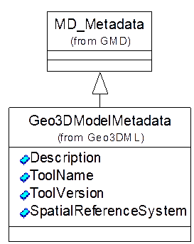
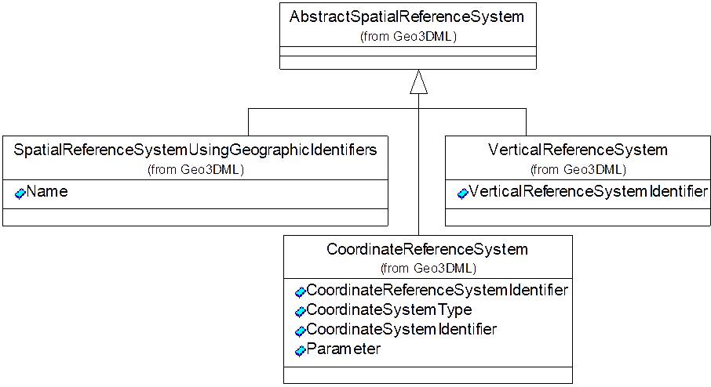
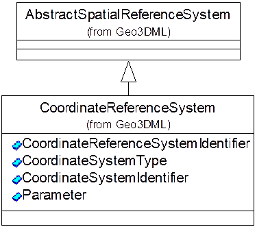
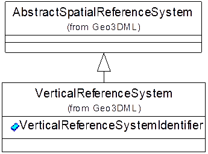

# 11 元数据模块

## 11.1 三维地质模型元数据

Geo3DML定义了描述三维地质模型的元数据结构——`geo3dml:Geo3DModelMetadata`，记录的信息包括关于地质模型的说明，建模所使用的建模工具等。该结构继承自GB/Z 24357-2009定义的`gmd:MD_Metadata`（见[图30](#pic-30)及[表31](#tbl-31)）。

<a id="pic-30" /><caption>图30 geo3dml:GeoModelMetadata的结构</caption>

其中，`Description`记录关于地质图的说明信息；`ToolName`及`ToolVersion`分别记录建模工具的名称及版本号；`SpatialReferenceSystem`可用于记录模型中几何对象的空间坐标参照系信息。关于模型创建人（或单位）的联系方式和建模日期等信息的记录规则则定义在`gmd:MD_Metadata`结构中。

<a id="tbl-31" /><caption>表31 geo3dml:Geo3DModelMetadata子元素列表（省略名字空间）</caption>

|序号|子集/实体名|元素名|定义|出现次数|类型|值域|
|---|---|---|---|---|---|---|
|27|Geo3DModelMetadata|Geo3DModelMetadata|地质模型元数据。||类||
|27.1||Description|关于模型的说明信息。|1|字符串|自由文本。|
|27.2||ToolName|创建该地质模型所使用的软件工具的名称。|1|字符串|自由文本。|
|27.3||ToolVersion|创建该地质模型所使用的软件工具的版本号。|1|字符串|自由文本。|
|27.4||SpatialReferenceSystem|空间数据参照系。|0..1|类|geo3dml:AbstractSpatialReferenceSystem具体类型的实例。|

## 11.2 空间数据参照系

Geo3DML依据《地质信息元数据标准》（DD2006-05）定义了空间数据参照系（·geo3dml: AbstractSpatialReferenceSystem·及其子类型）。描述空间参照系的数据结构见[图31](#pic-31)。

<a id="pic-31" /><caption>图31 空间参照系数据结构的类型关系</caption>

`geo3dml:AbstractSpatialReferenceSystem`是不包含任何子元素的抽象类型；`geo3dml:SpatialReferenceSystemUsingGeographicIdentifiers`表示基于地理标识的空间参照系；`geo3dml:CoordinateReferenceSystem`表示基于坐标的空间参照系；`geo3dml:VerticalReferenceSystem`表示垂向坐标参照系。上述类型及其结构均是依据《地质信息元数据标准》（DD2006-05）定义的。

## 11.3 基于地理标识的空间参照系

`geo3dml:SpatialReferenceSystemUsingGeographicIdentifiers`描述基于地理标识的空间参照系。其结构见[图32](#pic-32)及[表32](#tbl-32)。

<a id="pic-32" /><caption>图32 geo3dml:SpatialReferenceSystemUsingGeographicIdentifiers的结构</caption>

<a id="tbl-32" /><caption>表32 geo3dml:SpatialReferenceSystemUsingGeographicIdentifiers子元素列表（省略名字空间）</caption>

|序号|子集/实体名|元素名|定义|出现次数|类型|值域|
|---|---|---|---|---|---|---|
|28|SpatialReferenceSystemUsingGeographicIdentifiers|SpatialReferenceSystemUsingGeographicIdentifiers|基于地理标识的空间参照系。||类||
|28.1||Name|基于地理标识的空间参照系名称。|1|字符串|有效的空间参照系名称。|

## 11.4 基于坐标的空间参照系

`geo3dml:CoordinateReferenceSystem`描述基于坐标的空间参照系。其结构见[图33](#pic-33)及[表33](#tbl-33)。

<a id="pic-33" /><caption>图33 geo3dml:CoordinateReferenceSystem的结构</caption>

<a id="tbl-33" /><caption>表33 geo3dml:CoordinateReferenceSystem子元素列表（省略名字空间）</caption>

|序号|子集/实体名|元素名|定义|出现次数|类型|值域|
|---|---|---|---|---|---|---|
|29|CoordinateReferenceSystem|CoordinateReferenceSystem|基于坐标的空间参照系。||类||
|29.1||CoordinateReferenceSystemIdentifier|坐标参照系名称。|1|字符串|枚举值（见表后说明）。|
|29.2||CoordinateSystemType|坐标系类型名称。|1|字符串|枚举值（见表后说明）。|
|29.3||CoordinateSystemIdentifier|坐标系名称。|1|字符串|自由文本。|
|29.4||Parameter|采用投影坐标系时有关投影坐标参数的说明。|1|字符串|自由文本。|

`CoordinateReferenceSystemIdentifier`（坐标参照系名称）可取的枚举值如下：

（1）1954北京坐标系；

（2）1980西安坐标系；

（3）地方独立坐标系：指相对于独立国家坐标系的局部坐标系；

（4）全球参考系：是用于检索陆地卫星数据的一个全球检索系；

（5）IAG 1979年大地参照系：指国际大地测量协会1979年大会通过的大地参照系；

（6）世界大地坐标系：质点在地球质心；

（7）2000中国大地坐标系统：是国家GPS大地控制网，地心坐标系。

`CoordinateSystemType`（坐标系类型名称）可取的枚举值如下：

（1）笛卡尔坐标系：相互正交于远点的n个数轴（n是任意正整数）组成的n维坐标系；

（2）大地坐标系：用经度和纬度表示地面点位置的球面坐标；

（3）投影坐标系：由不同的投影方法所形成的坐标系；

（4）极坐标系：用某点至极点的距离和方向表示该点位置的坐标系；

（5）重力相关坐标系：重力测量及其计算的一种基准。

## 11.5 垂向坐标参照系

`geo3dml:VerticalReferenceSystem`描述垂向坐标参照系。其结构见[图34](#pic-34)及[表34](#tbl-34)。

<a id="pic-34" /><caption>图34 geo3dml:VerticalReferenceSystem的结构</caption>

<a id="tbl-34" /><caption>表34 geo3dml:VerticalReferenceSystem子元素列表（省略名字空间）</caption>

|序号|子集/实体名|元素名|定义|出现次数|类型|值域|
|---|---|---|---|---|---|---|
|30|VerticalReferenceSystem|VerticalReferenceSystem|垂向坐标参照系。||类||
|30.1||VerticalReferenceSystemIdentifier|垂向坐标参照系名称。|1|字符串|枚举值（见表后说明）。|

`VerticalReferenceSystemIdentifier`（垂向坐标参照系名称）可取的枚举值如下：

（1）高程：高程类别的一级分类名；

（2）1956年黄海高程系：高程类别的二级分类名；

（3）1985年国家高程系：高程类别的二级分类名；

（4）地方独立高程系：高程类别的二级分类名，是独立于国家高程系外的局部高程坐标系；

（5）深度：深度类别的一级分类名；

（6）略最低低潮面：深度类别的二级分类名，是印度大潮低潮面；

（7）理论深度基准面：深度类别的二级分类名；

（8）重力：重力相关类别的一级分类名；

（9）国家重力控制网：重力相关类别的二级分类名，是57网。重力基准由苏联引入，属波茨坦重力基准；

（10）国家1985重力基准网：重力相关类别的二级分类名，是85网。综合性的重力基准；

（11）维也纳重力基准：重力相关类别的二级分类名；

（12）波茨坦重力基准：重力相关类别的二级分类名；

（13）国际重力基准网1971：重力相关类别的二级分类名，即IGSN-71；

（14）国际绝对重力基准网：重力相关类别的二级分类名，即IAGBN；

（15）相对高度：相对高度类别的一级分类名。
