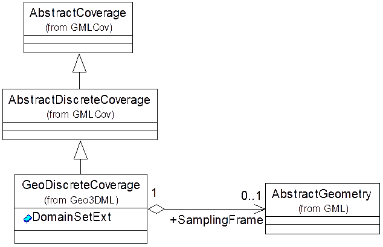

# 9 属性场数据模块

## 9.1 数据模型

Geo3DML属性场模型用于描述沿几何对象所在空间分布的地学属性场信息，如分布于某曲面的顶点集合中的地学属性。几何对象中描述空间位置和形态的单元包括顶点（Vertex）、棱（Edge）、面元（Face）以及体元（Voxel）。Geo3DML的属性场模型支持在这些单元上记录属性场信息。不同维度几何对象上可记录地学属性的位置见[表17](#tbl-17)。

<a name="tbl-17" /><caption>表17 不同维度几何对象上可记录地学属性的位置</caption>

|维度|几何单元|可记录属性的位置|
|---|---|---|
|0|点|顶点|
|1|线|顶点、棱|
|2|面元(如三角形)|顶点、棱、面元|
|3|体元|顶点、棱、面元、体元|

## 9.2 实现描述

按GML规范，场数据可采用覆盖（Coverage）数据结构表达。按此数据结构，属性场是一个由空间位置向属性值的映射，空间位置是定义域，属性值是值域。Geo3DML定义了`geo3dml:GeoDiscreteCoverage`作为对`gmlcov:AbstractDiscreteCoverage`的扩展，支持设置属性场定义域所属的超集，如定义域可能是某几何对象的顶点（或棱或面元或体元）集合的子集。`geo3dml:GeoDiscreteCoverage`的结构见[图20](#pic-20)及[表18](#tbl-18)。

<a name="pic-20" /><caption>图20 geo3dml:GeoDiscreteCoverage的结构</caption>

<a name="tbl-18" /><caption>表18 geo3dml:GeoDiscreteCoverage子元素列表（省略名字空间）</caption>

|序号|子集/实体名|元素名|定义|出现次数|类型|值域|
|---|---|---|---|---|---|---|
|14|GeoDiscreteCoverage|GeoDiscreteCoverage|属性场数据结构。||类||
|14.1|DomainSetExt|DomainSetExt|属性场数据定义域的扩展定义：描述定义域所属的超集。|0..1|||
|14.1.1||SamplingFrame|所关联的几何对象。该几何对象的某组成元素的集合是属性场数据定义域的超集。|1|类|对gml:AbstractGeometry实例的引用。|
|14.1.2||SamplingTarget|指示SamplingFrame所指向的几何对象中构成定义域超集的元素。|1|字符串|枚举值：VERTEX（顶点），EDGE（棱），FACE（面元），VOXEL（体元）。|

`geo3dml:GeoDiscreteCoverage`继承自`gmlcov:AbstractDiscreteCoverage`，而`gmlcov: AbstractDiscreteCoverage`结构中的`gml:domainSet`用于定义属性场的定义域。当`gml:domainSet`定义的值为空时，`geo3dml:DomainSetExt`所描述的集合就是定义域。当`gml:domainSet`定义的值不为空时，`geo3dml:DomainSetExt`所描述的集合是`gml:domainSet`所记录的定义域的超集。
